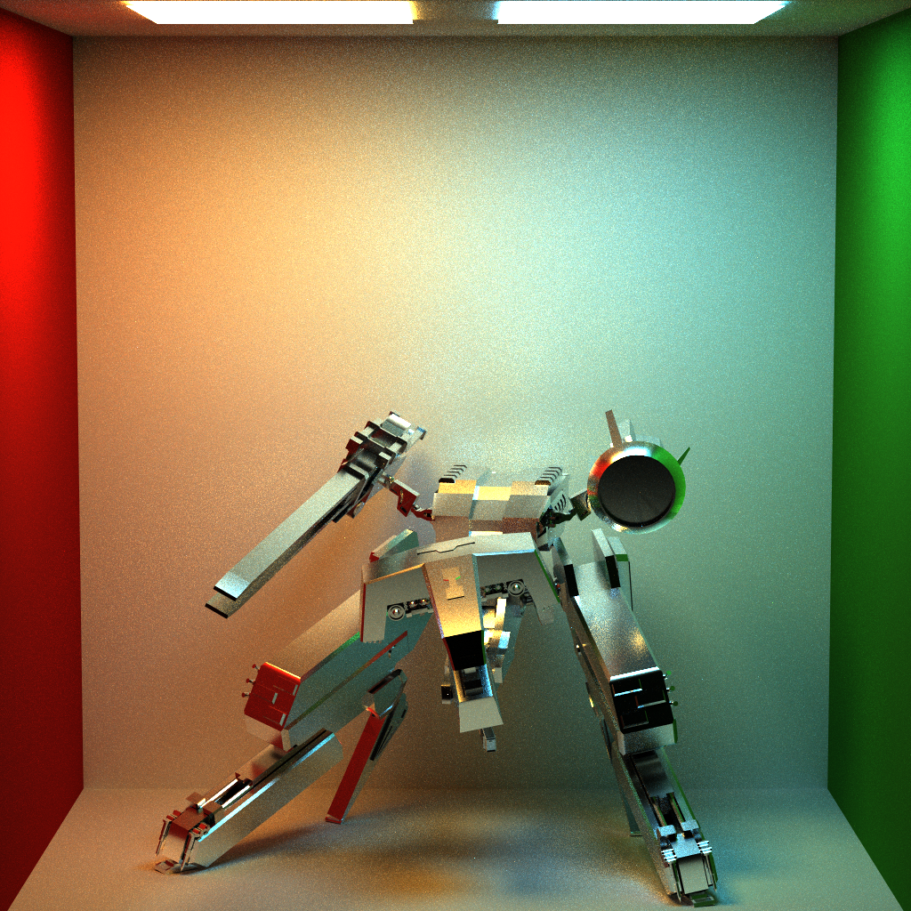
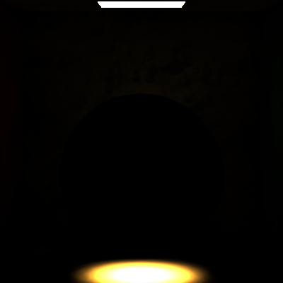
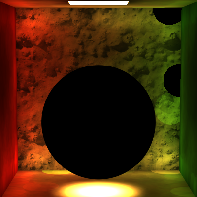

# Tracer
This project is a path tracer. It is developed in Qt. Multi-importance sampling, ruassian roulette termination, micro-facet material, fresnel effect, constructive solid geometry and signed distance field and an experimental photon mapper are implemented.

---

* ### Lens Based Camera 

###### Fulllight Integrator 1024x1024 pixels 20x20 samples 5 maximum recursions 1.5 hours

---

* ### Lens Based Camera

* ### BVH + KD Tree

* ### Texture

* ### Normal Map

###### Fulllight Integrator 1024x1024 pixels 20x20 samples 5 maximum recursions 6 hours

###### (N64 Catridge model made by Chris Sweetwood @ sketchfab)

---

* ### BVH + KD Tree

* ### Chrome Material

###### Fulllight Integrator 1024x1024 pixels 20x20 samples 5 maximum recursions 63.5 hours

###### (Metal Gear Rex model made by me)

---

* ### BVH + KD Tree

* ### Texture 

* ### Normal Map

* ### Chrome Material

###### Fulllight Integrator 1024x1024 pixels 20x20 samples 5 maximum recursions 7.8 hours

###### (Game Boy model made by danny_p3d @ sketchfab)

---

* ### Implicit Surface

* ### Chrome Material

###### Fulllight Integrator 400x400 pixels 10x10 samples 5 maximum recursions 5.6 hours

---

* ### Implicit Surface

* ### Chrome Material

###### Fulllight Integrator 400x400 pixels 20x20 samples 5 maximum recursions 60 hours

---

* ### Contructive Solid Geometry

* ### Difference and Union

###### Fulllight Integrator 400x400 pixels 20x20 samples 5 maximum recursions 1 minute

---

* ### Constructive Solid Geometry

* ### Intersection and Union

###### Fulllight Integrator 400x400 pixels 20x20 samples 5 maximum recursions 1 minute

---

* ### Multi-Importance Sampling

Directlight Integrator 768x512 pixels 10x10 samples

|          Without MIS         |             With MIS            |
|:----------------------------:|:-------------------------------:|
|||

---

* ### Directional Light

###### Fulllight Integrator 400x400 pixels 20x20 samples 5 maximum recursions 10 minutes

---

* ### Environment Light

###### Fulllight Integrator 400x400 pixels 20x20 samples 5 maximum recursions 1 minute

---

* ### Unfinished Photon Mapper

###### Photon Integrator 500,000 photons emitted, sampling radius 1.9

###### Photon Integrator 2,000,000 photons emitted, sampling radius 1.8

###### Photon Integrator 100,000 photons emitted, sampling radius 0.8

|    Caustic Photon Map     |     Indirect Photon Map    |     Path Tracer Reference    |
|:-------------------------:|:--------------------------:|:----------------------------:|
||||